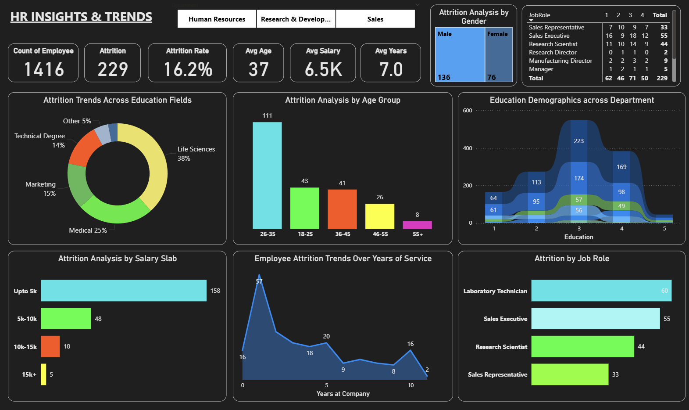
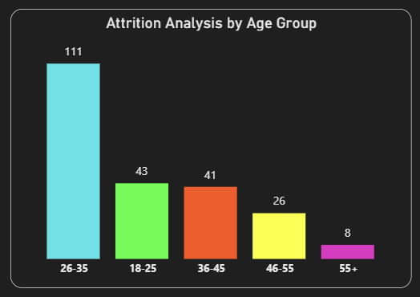
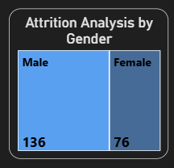
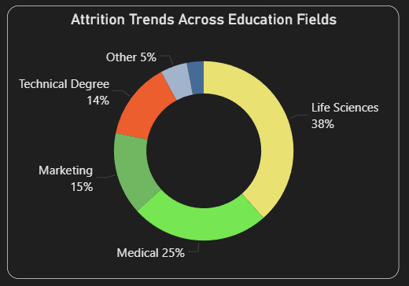
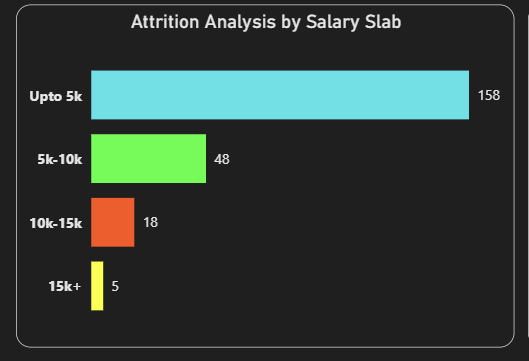
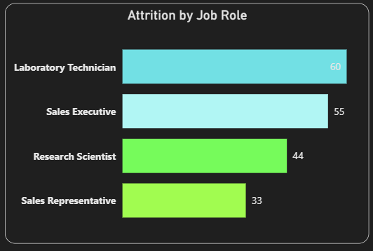
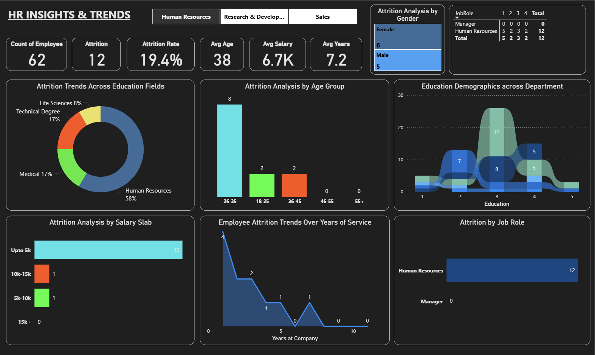
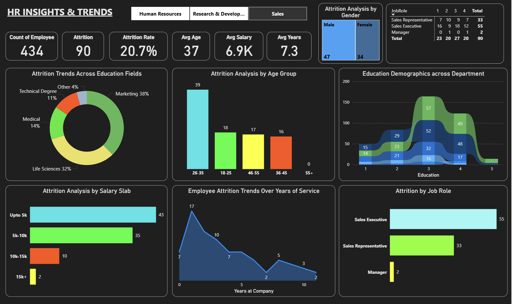
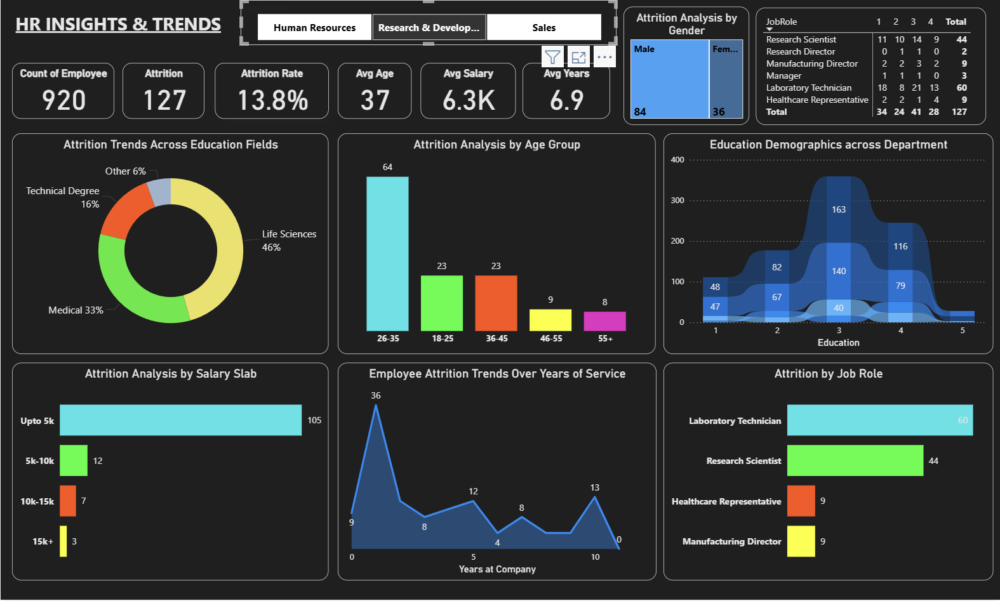

# 📊 Employee Attrition Analysis & HR Insights

 <br>

## 📌 Project Overview
Employee attrition (resignation/turnover) is a critical challenge for Human Resources (HR) departments.  
Understanding **why employees leave**, **which groups are most at risk**, and **what patterns drive attrition** can help organizations reduce turnover and improve workforce stability.  

In this project, I conducted a **data analytics workflow** to uncover attrition trends across demographics, job roles, education backgrounds, salary bands, and years of service.  

The analysis was delivered through an **interactive dashboard** that provides **actionable insights** for HR leaders to support **strategic decision-making**.  

---

## 🛠️ Tools & Technologies
- **Power BI** → Interactive dashboard creation  
- **Excel** → Initial data exploration & preprocessing  
- **GitHub** → Version control & project documentation  

---

## 📂 Project Structure
```bash
📁 Employee-Attrition-Analysis
├── data/                 # Raw & processed datasets
├── dashboard/            # Power BI / Tableau dashboards
└── README.md             # Final reports & HR recommendations
```

## 🎯 Actionable Insights for HR

### 1️⃣ Attrition by Demographics  
**Age (26–35 dominates attrition)**  
 <br>
- 📊 >45% of attrition comes from employees aged 26–35.  
- 💡 This is the *early-to-mid career* phase → employees seek **stability, promotions, or higher salaries**.  
- ✅ **HR Action**:  
  - Develop career pathing & internal mobility programs.  
  - Provide mentorship programs to ensure clear career direction.  

**Gender (male attrition > female attrition)**  
 <br>
- 📊 Male attrition is higher (136 vs 76).  
- 💡 Often observed in male-dominated roles (Sales/Technical).  
- ✅ **HR Action**:  
  - Evaluate work-life balance in male-dominant job roles.  
  - Conduct gender-segmented exit interviews to capture specific reasons.  

---

### 2️⃣ Attrition by Education Field  
 <br>
- 📊 Life Sciences (38%) & Medical (25%) account for a large share of attrition.  
- 💡 These fields are in high external demand → employees can easily move to competitors.  
- ✅ **HR Action**:  
  - Provide retention incentives (bonuses, flexible benefits).  
  - Invest in learning & development opportunities to support internal growth.  

---

### 3️⃣ Attrition by Salary Slab  
 <br>
- 📊 Majority of attrition occurs at salaries ≤ $5K (158 out of 229 cases).  
- 💡 Low compensation is a key driver of resignations.  
- ✅ **HR Action**:  
  - Review salary benchmarks against industry standards.  
  - Introduce variable pay (performance-based incentives).  
  - Strengthen non-monetary benefits (healthcare, training, hybrid work options).  

---

### 4️⃣ Attrition by Job Role  
 <br>
- 📊 Highest attrition observed in: Sales Executives (55), Lab Technicians (60), Research Scientists (44).  
- 💡 These roles face **high workloads & limited career growth opportunities**.  
- ✅ **HR Action**:  
  - **Sales Executives** → redesign incentive schemes, provide growth paths to Sales Manager.  
  - **Lab Technicians & Researchers** → invest in training, recognition programs, and clear progression paths.  

---

### 5️⃣ Attrition by Years of Service  
 <br>
**Early attrition (0–2 years)**  
- 📊 Sharp increase in resignations within 1–2 years (57 cases in year 1).  
- 💡 Indicates weak onboarding & employee engagement.  
- ✅ **HR Action**:  
  - Strengthen onboarding excellence & buddy programs (first 6 months).  
  - Conduct early engagement surveys (within first 3 months).  

**Attrition spike at ~10 years**  
- 📊 Noticeable increase in attrition around 10 years of service.  
- 💡 Senior employees may feel stagnant or “stuck” in their careers.  
- ✅ **HR Action**:  
  - Introduce loyalty bonuses or sabbatical programs.  
  - Provide career progression pathways into leadership roles.  

---

### 6️⃣ Department-Specific Insights  
 <br>
 <br>
 <br>
**HR Department attrition (19.4%) > Sales (13.8%)**  
- 💡 High HR turnover may be linked to job stress, lack of recognition, or limited decision-making authority.  
- ✅ **HR Action**:  
  - Invest in HR professional development (certifications, workshops).  
  - Increase HR’s decision-making authority to enhance value perception.  

**Sales Department attrition high in Sales Executives (55)**  
- ✅ **HR Action**: Review sales workload, targets, and reward systems.  

---

### 7️⃣ Strategic Recommendations for HR Leaders  
✔ **Retention Playbook** → Build a comprehensive strategy covering onboarding excellence, compensation review, career development, and work-life balance.  
✔ **Data-Driven Monitoring** → Leverage real-time dashboards & predictive attrition modeling.  
✔ **Customized Interventions** → Tailored strategies per employee cluster:  
- Young employees → career growth opportunities.  
- Low-salary employees → compensation improvements.  
- Senior employees → recognition & leadership roles.  

---

## 📌 Deliverables  
- 📊 **Exploratory Data Analysis (EDA)** notebooks.  
- 📈 **Interactive dashboard** (Power BI/Tableau).  
- 📑 **Final HR insights report** with actionable recommendations.  

---

## 🚀 Future Enhancements  
- Predictive modeling to identify employees most at risk of leaving.  
- Sentiment analysis on employee feedback & surveys.  
- Integration with HRIS systems for automated monitoring.  
